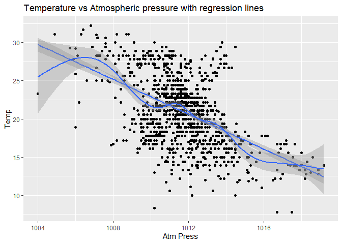
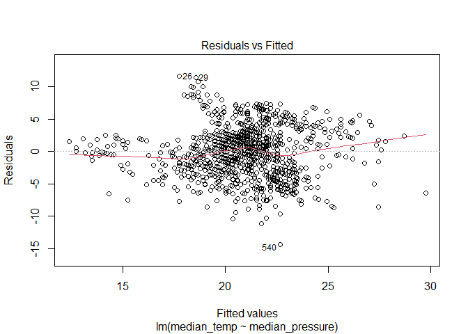
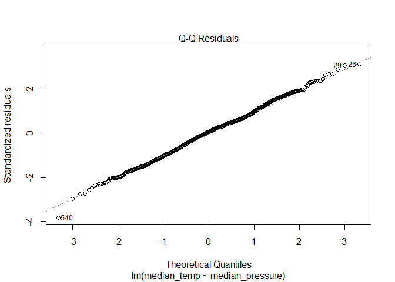
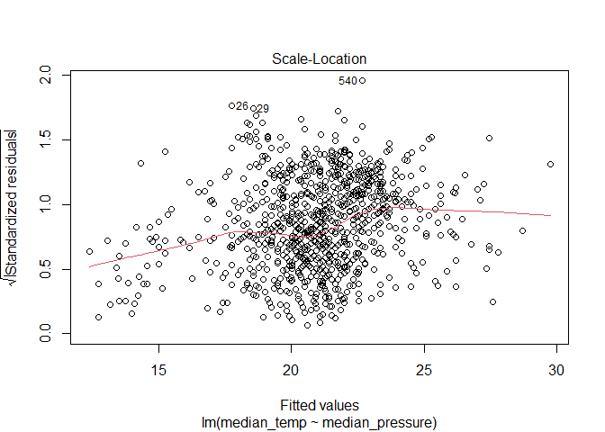
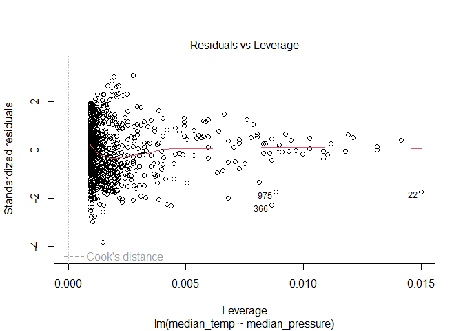
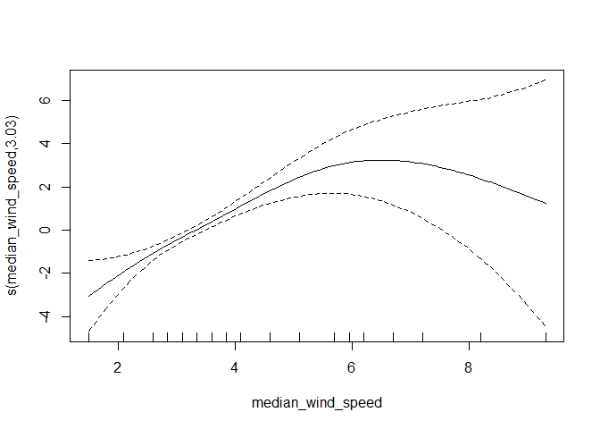

Lab 05 - Data Wrangling
================

# Learning goals

- Use the `merge()` function to join two datasets.
- Deal with missings and impute data.
- Identify relevant observations using `quantile()`.
- Practice your GitHub skills.

# Lab description

For this lab we will be dealing with the meteorological dataset `met`.
In this case, we will use `data.table` to answer some questions
regarding the `met` dataset, while at the same time practice your
Git+GitHub skills for this project.

This markdown document should be rendered using `github_document`
document.

# Part 1: Setup a Git project and the GitHub repository

1.  Go to wherever you are planning to store the data on your computer,
    and create a folder for this project

2.  In that folder, save [this
    template](https://github.com/JSC370/JSC370-2024/blob/main/labs/lab05/lab05-wrangling-gam.Rmd)
    as “README.Rmd”. This will be the markdown file where all the magic
    will happen.

3.  Go to your GitHub account and create a new repository of the same
    name that your local folder has, e.g., “JSC370-labs”.

4.  Initialize the Git project, add the “README.Rmd” file, and make your
    first commit.

5.  Add the repo you just created on GitHub.com to the list of remotes,
    and push your commit to origin while setting the upstream.

Most of the steps can be done using command line:

``` sh
# Step 1
cd ~/Documents
mkdir JSC370-labs
cd JSC370-labs

# Step 2
wget https://raw.githubusercontent.com/JSC370/JSC370-2024/main/labs/lab05/lab05-wrangling-gam.Rmd
mv lab05-wrangling-gam.Rmd README.Rmd
# if wget is not available,
curl https://raw.githubusercontent.com/JSC370/JSC370-2024/main/labs/lab05/lab05-wrangling-gam.Rmd --output README.Rmd

# Step 3
# Happens on github

# Step 4
git init
git add README.Rmd
git commit -m "First commit"

# Step 5
git remote add origin git@github.com:[username]/JSC370-labs
git push -u origin master
```

You can also complete the steps in R (replace with your paths/username
when needed)

``` r
# Step 1
setwd("~/Documents")
dir.create("JSC370-labs")
setwd("JSC370-labs")

# Step 2
download.file(
  "https://raw.githubusercontent.com/JSC370/JSC370-2024/main/labs/lab05/lab05-wrangling-gam.Rmd",
  destfile = "README.Rmd"
  )

# Step 3: Happens on Github

# Step 4
system("git init && git add README.Rmd")
system('git commit -m "First commit"')

# Step 5
system("git remote add origin git@github.com:[username]/JSC370-labs")
system("git push -u origin master")
```

Once you are done setting up the project, you can now start working with
the MET data.

## Setup in R

1.  Load the `data.table` (and the `dtplyr` and `dplyr` packages),
    `mgcv`, `ggplot2`, `leaflet`, `kableExtra`.

``` r
library(data.table)
library(dtplyr)
library(dplyr)
```

    ## 
    ## 载入程辑包：'dplyr'

    ## The following objects are masked from 'package:data.table':
    ## 
    ##     between, first, last

    ## The following objects are masked from 'package:stats':
    ## 
    ##     filter, lag

    ## The following objects are masked from 'package:base':
    ## 
    ##     intersect, setdiff, setequal, union

``` r
library(tidyr)
library(mgcv)
```

    ## 载入需要的程辑包：nlme

    ## 
    ## 载入程辑包：'nlme'

    ## The following object is masked from 'package:dplyr':
    ## 
    ##     collapse

    ## This is mgcv 1.9-0. For overview type 'help("mgcv-package")'.

``` r
library(leaflet)
library(ggplot2)
library(leaflet)
library(kableExtra)
```

    ## 
    ## 载入程辑包：'kableExtra'

    ## The following object is masked from 'package:dplyr':
    ## 
    ##     group_rows

``` r
library(mgcv)
```

``` r
fn <- "https://raw.githubusercontent.com/JSC370/JSC370-2024/main/data/met_all_2023.gz"
if (!file.exists("met_all_2023.gz"))
  download.file(fn, destfile = "met_all_2023.gz")
met <- data.table::fread("met_all_2023.gz")
```

    ## Warning in grep(pattern, bfr, value = TRUE): unable to translate '
    ## <c7><fd><b6><af><c6><f7> C <d6>еľ<ed><ca><c7> Windows-SSD' to a wide string

    ## Warning in grep(pattern, bfr, value = TRUE): input string 1 is invalid

    ## Warning in grep(pattern, bfr, value = TRUE): unable to translate '
    ## <be><ed><b5><c4><d0><f2><c1>к<c5><ca><c7> 624C-C245' to a wide string

    ## Warning in grep(pattern, bfr, value = TRUE): input string 2 is invalid

    ## Warning in grep(pattern, bfr, value = TRUE): unable to translate '
    ## C:\Users\marcu\AppData\Local\Temp <b5><c4>Ŀ¼' to a wide string

    ## Warning in grep(pattern, bfr, value = TRUE): input string 4 is invalid

    ## Warning in grep(pattern, bfr, value = TRUE): unable to translate ' 147
    ## <b8><f6><ce>ļ<fe> 76,285,362 <d7>ֽ<da>' to a wide string

    ## Warning in grep(pattern, bfr, value = TRUE): input string 306 is invalid

    ## Warning in grep(pattern, bfr, value = TRUE): unable to translate ' 153
    ## <b8><f6>Ŀ¼ 17,430,536,192 <bf><c9><d3><c3><d7>ֽ<da>' to a wide string

    ## Warning in grep(pattern, bfr, value = TRUE): input string 307 is invalid

2.  Load the met data from
    <https://github.com/JSC370/JSC370-2024/main/data/met_all_2023.gz> or
    (Use
    <https://raw.githubusercontent.com/JSC370/JSC370-2024/main/data/met_all_2023.gz>
    to download programmatically), and also the station data. For the
    latter, you can use the code we used during lecture to pre-process
    the stations data:

``` r
# Download the data
stations <- fread("ftp://ftp.ncdc.noaa.gov/pub/data/noaa/isd-history.csv")
stations[, USAF := as.integer(USAF)]
```

    ## Warning in eval(jsub, SDenv, parent.frame()): 强制改变过程中产生了NA

``` r
# Dealing with NAs and 999999
stations[, USAF   := fifelse(USAF == 999999, NA_integer_, USAF)]
stations[, CTRY   := fifelse(CTRY == "", NA_character_, CTRY)]
stations[, STATE  := fifelse(STATE == "", NA_character_, STATE)]

# Selecting the three relevant columns, and keeping unique records
stations <- unique(stations[, list(USAF, CTRY, STATE, LAT, LON)])

# Dropping NAs
stations <- stations[!is.na(USAF)]

# Removing duplicates
stations[, n := 1:.N, by = .(USAF)]
stations <- stations[n == 1,][, n := NULL]

# Read in the met data and fix lat, lon, temp
```

3.  Merge the data as we did during the lecture. Use the `merge()` code
    and you can also try the tidy way with `left_join()`

``` r
data <- merge(
  x     = met,      
  y     = stations, 
  by.x  = "USAFID",
  by.y  = "USAF", 
  all.x = TRUE,      
  all.y = FALSE
  )
data$lat <- met$lat/1000
data$lon <- met$lon/1000
data$wind.sp <- met$wind.sp/10
data$temp <- met$temp/10
data$dew.point <- met$dew.point/10
data$atm.press <- met$atm.press/10
data$relative_humidity <- 100*((112-0.1*data$temp+data$dew.point)/(112+0.9*data$temp))^8
head(data)
```

    ##    USAFID  WBAN year month day hour min    lat      lon elev wind.dir
    ## 1: 690150 93121 2023     6   1   NA  56 34.294 -116.147  696      240
    ## 2: 690150 93121 2023     6   1    1  56 34.294 -116.147  696       NA
    ## 3: 690150 93121 2023     6   1    2  56 34.294 -116.147  696      300
    ## 4: 690150 93121 2023     6   1    3  56 34.294 -116.147  696      300
    ## 5: 690150 93121 2023     6   1    4  56 34.294 -116.147  696      310
    ## 6: 690150 93121 2023     6   1    5  56 34.294 -116.147  696       20
    ##    wind.dir.qc wind.type.code wind.sp wind.sp.qc ceiling.ht ceiling.ht.qc
    ## 1:           5              N     1.5          5      22000             5
    ## 2:           9              C      NA          5      22000             5
    ## 3:           5              N     9.3          5      22000             5
    ## 4:           5              N    10.8          5      22000             5
    ## 5:           5              N     7.2          5      22000             5
    ## 6:           5              N     3.1          5      22000             5
    ##    ceiling.ht.method sky.cond vis.dist vis.dist.qc vis.var vis.var.qc temp
    ## 1:                 9        N    16093           5       N          5 28.9
    ## 2:                 9        N    16093           5       N          5 28.9
    ## 3:                 9        N    16093           5       N          5 26.1
    ## 4:                 9        N    16093           5       N          5 23.9
    ## 5:                 9        N    16093           5       N          5 23.3
    ## 6:                 9        N    16093           5       N          5 22.2
    ##    temp.qc dew.point dew.point.qc atm.press atm.press.qc CTRY STATE    LAT
    ## 1:       5       0.6            5    1004.0            5   US    CA 34.294
    ## 2:       5       2.2            5    1004.1            5   US    CA 34.294
    ## 3:       5       5.0            5    1004.6            5   US    CA 34.294
    ## 4:       5       6.1            5    1005.2            5   US    CA 34.294
    ## 5:       5       6.7            5    1005.5            5   US    CA 34.294
    ## 6:       5       6.7            5    1006.5            5   US    CA 34.294
    ##         LON relative_humidity
    ## 1: -116.147          15.94723
    ## 2: -116.147          17.90561
    ## 3: -116.147          25.81348
    ## 4: -116.147          31.83148
    ## 5: -116.147          34.41113
    ## 6: -116.147          36.80831

## Question 1: Identifying Representative Stations

Across all weather stations, which stations have the median values of
temperature, wind speed, and atmospheric pressure? Using the
`quantile()` function, identify these three stations. Do they coincide?

``` r
median_temp <- median(data$temp, na.rm = TRUE)
median_wind_sp <- median(data$wind.sp, na.rm = TRUE)
median_atm_press <- median(data$atm.press, na.rm = TRUE)
new_data <- (data %>% 
               group_by(USAFID) %>% 
               summarise(median_temp = median(temp, na.rm = TRUE),
                         median_wind_speed = median(wind.sp, na.rm = TRUE),
                         median_pressure = median(atm.press, na.rm = TRUE)))
```

Next identify the stations have these median values.

``` r
q1 <- new_data$USAFID[which(new_data$median_temp == median_temp & new_data$median_wind_speed == median_wind_sp & new_data$median_pressure == median_atm_press)]
print(q1)
```

    ## [1] 723119

Knit the document, commit your changes, and save it on GitHub. Don’t
forget to add `README.md` to the tree, the first time you render it.

## Question 2: Identifying Representative Stations per State

Now let’s find the weather stations by state with closest temperature
and wind speed based on the euclidean distance from these medians.

``` r
state_median <- data %>% 
  group_by(STATE) %>% 
  summarise(state_median_temp =  median(temp, na.rm = TRUE),
            state_median_wind_speed = median(wind.sp, na.rm = TRUE))

station_median <- data %>% 
  group_by(USAFID) %>% 
  summarise(station_median_temp = median(temp, na.rm = TRUE),
            station_median_wind_speed = median(wind.sp, na.rm = TRUE),
            station_median_lon = median(lon, na.rm = TRUE),
            station_median_lat = median(lat, na.rm = TRUE),
            STATE = min(STATE))

new_data <- merge(state_median, station_median, by = "STATE")

new_data$temp_diff <- new_data$station_median_temp - new_data$state_median_temp
new_data$wind_speed_diff <- new_data$station_median_wind_speed - new_data$state_median_wind_speed
new_data$euclidean <- sqrt(new_data$temp_diff^2 + new_data$wind_speed_diff^2)

q2 <- new_data %>% 
  group_by(STATE) %>% 
  arrange(euclidean) %>% 
  slice(1)
print(q2)
```

    ## # A tibble: 48 × 11
    ## # Groups:   STATE [48]
    ##    STATE state_median_temp state_median_wind_speed USAFID station_median_temp
    ##    <chr>             <dbl>                   <dbl>  <int>               <dbl>
    ##  1 AL                 23.3                     2.6 720265                23.1
    ##  2 AR                 24                       2.6 722188                23.9
    ##  3 AZ                 25.6                     3.6 722728                25.6
    ##  4 CA                 17                       3.6 722950                16.7
    ##  5 CO                 15                       3.6 724695                15.1
    ##  6 CT                 19.4                     3.1 725040                19.4
    ##  7 DE                 21.3                     3.6 724093                21.1
    ##  8 FL                 26.7                     3.6 722024                26.7
    ##  9 GA                 23                       2.6 722255                23  
    ## 10 IA                 22                       3.1 722097                22  
    ## # ℹ 38 more rows
    ## # ℹ 6 more variables: station_median_wind_speed <dbl>,
    ## #   station_median_lon <dbl>, station_median_lat <dbl>, temp_diff <dbl>,
    ## #   wind_speed_diff <dbl>, euclidean <dbl>

Knit the doc and save it on GitHub.

## Question 3: In the Geographic Center?

For each state, identify which station is closest to the geographic
mid-point (median) of the state. Combining these with the stations you
identified in the previous question, use `leaflet()` to visualize all
~100 points in the same figure, applying different colors for the
geographic median and the temperature and wind speed median.

``` r
state_median <- data %>% 
  group_by(STATE) %>% 
  summarise(state_median_lon =  median(lon, na.rm = TRUE),
            state_median_lat = median(lat, na.rm = TRUE))

station_median <- data %>% 
  group_by(USAFID) %>% 
  summarise(station_median_lon = median(lon, na.rm = TRUE),
            station_median_lat = median(lat, na.rm = TRUE),
            STATE = min(STATE))

new_data <- merge(state_median, station_median, by = "STATE")

new_data$x <- new_data$station_median_lon - new_data$state_median_lon
new_data$y <- new_data$station_median_lat - new_data$state_median_lat
new_data$euclidean <- sqrt(new_data$x^2 + new_data$y^2)

q3 <- new_data %>% 
  group_by(STATE) %>% 
  arrange(euclidean) %>% 
  slice(1)

l <- leaflet(q3) %>% 
  addProviderTiles('CartoDB.Positron') %>% 
  addCircleMarkers(data = q3, 
                   lat = ~station_median_lat, lng = ~station_median_lon, 
                   opacity = 0.2, fillOpacity = 0.5, radius = 2, color = "red",
                   group = "Closest to Geographical median") %>% 
  addCircleMarkers(data = q2, 
                   lat = ~station_median_lat, lng = ~station_median_lon, 
                   opacity = 0.2, fillOpacity = 0.5, radius = 2, color = "blue",
                   group = "Q2 closest")

l
```

<div class="leaflet html-widget html-fill-item" id="htmlwidget-0a644f5ed91f298eef74" style="width:672px;height:480px;"></div>
<script type="application/json" data-for="htmlwidget-0a644f5ed91f298eef74">{"x":{"options":{"crs":{"crsClass":"L.CRS.EPSG3857","code":null,"proj4def":null,"projectedBounds":null,"options":{}}},"calls":[{"method":"addProviderTiles","args":["CartoDB.Positron",null,null,{"errorTileUrl":"","noWrap":false,"detectRetina":false}]},{"method":"addCircleMarkers","args":[[33.178,35.257,33.466,36.985,39.05,41.384,39.133,28.821,32.633,41.691,43.567,40.483,41.066,38.068,37.578,30.558,42.212,39.173,44.533,43.322,45.544,38.947,32.32,47.517,35.582,48.39,40.893,43.205,40.624,33.45,39.601,41.701,40.28,35.357,44.5,40.218,41.597,33.967,43.767,35.38,31.133,40.219,37.4,44.533,47.445,44.783,39,43.062],[-86.782,-93.095,-111.721,-120.11,-105.516,-72.506,-75.467,-81.81,-83.59999999999999,-93.566,-116.24,-88.95,-86.182,-97.861,-84.77,-92.099,-71.114,-76.684,-69.667,-84.688,-94.05200000000001,-92.68300000000001,-90.078,-111.183,-79.101,-100.024,-97.997,-71.503,-74.669,-105.516,-116.005,-74.795,-83.11499999999999,-96.943,-123.283,-76.855,-71.41200000000001,-80.467,-99.318,-86.246,-97.717,-111.723,-77.517,-72.61499999999999,-122.314,-89.667,-80.274,-108.447],2,null,"Closest to Geographical median",{"interactive":true,"className":"","stroke":true,"color":"red","weight":5,"opacity":0.2,"fill":true,"fillColor":"red","fillOpacity":0.5},null,null,null,null,null,{"interactive":false,"permanent":false,"direction":"auto","opacity":1,"offset":[0,0],"textsize":"10px","textOnly":false,"className":"","sticky":true},null]},{"method":"addCircleMarkers","args":[[32.915,35.212,31.421,33.938,39.717,41.164,38.69,25.91,32.516,41.584,42.545,39.78,40.948,39.374,38.23,30.833,42.468,38.142,46.87,42.264,43.677,38.817,32.338,45.807,35.541,46.782,40.6,42.9,39.366,33.45,39.417,43.111,40.225,35.668,44.843,40.435,41.921,33.317,43.389,35.178,29.36,40.219,38.721,44.883,46.117,42.617,39.404,41.444],[-85.96299999999999,-91.73699999999999,-110.846,-118.386,-104.75,-73.127,-75.36199999999999,-80.283,-84.94199999999999,-95.339,-113.768,-90.238,-87.18300000000001,-99.83,-85.663,-93.333,-71.295,-76.429,-68.017,-84.456,-92.18000000000001,-92.215,-90.221,-108.546,-78.39,-100.757,-98.426,-72.267,-75.078,-105.516,-118.716,-76.104,-83.352,-95.949,-117.809,-75.38200000000001,-71.491,-79.31699999999999,-99.843,-86.066,-99.17400000000001,-111.723,-77.515,-72.233,-122.893,-89.033,-77.97499999999999,-106.827],2,null,"Q2 closest",{"interactive":true,"className":"","stroke":true,"color":"blue","weight":5,"opacity":0.2,"fill":true,"fillColor":"blue","fillOpacity":0.5},null,null,null,null,null,{"interactive":false,"permanent":false,"direction":"auto","opacity":1,"offset":[0,0],"textsize":"10px","textOnly":false,"className":"","sticky":true},null]}],"limits":{"lat":[25.91,48.39],"lng":[-123.283,-68.017]}},"evals":[],"jsHooks":[]}</script>

``` r
#blue is closest to state median temp and atm pressure
#red is closest to state geographical centre
```

Knit the doc and save it on GitHub.

## Question 4: Summary Table with `kableExtra`

Generate a summary table using `kable` where the rows are each state and
the columns represent average temperature broken down by low, median,
and high elevation stations.

Use the following breakdown for elevation:

- Low: elev \< 93
- Mid: elev \>= 93 and elev \< 401
- High: elev \>= 401

``` r
new_data <- data %>% mutate(elev_cat = case_when(
  elev < 93 ~ "Low",
  elev >= 93 & elev < 401 ~ "mid",
  elev >= 401 ~ "high")
)

summary_table <- new_data %>%
  group_by(STATE, elev_cat) %>%
  summarise(avg_temp = mean(temp, na.rm = TRUE), .groups = "drop") %>%
  spread(key = elev_cat, value = avg_temp) %>%
  ungroup()

kable(summary_table, caption = "Average temperature by elevation category and state")
```

| STATE |      high |      Low |      mid |
|:------|----------:|---------:|---------:|
| AL    |        NA | 25.07106 | 23.79775 |
| AR    | 23.723926 | 25.58698 | 24.40578 |
| AZ    | 23.892609 | 29.28585 | 30.38057 |
| CA    | 18.148808 | 18.25508 | 18.77071 |
| CO    | 15.184075 |       NA |       NA |
| CT    |        NA | 19.37249 | 18.78433 |
| DE    |        NA | 21.40611 |       NA |
| FL    |        NA | 26.61484 |       NA |
| GA    |        NA | 24.80529 | 23.23841 |
| IA    | 21.992787 |       NA | 22.26228 |
| ID    | 16.415667 |       NA |       NA |
| IL    | 20.843173 |       NA | 22.11707 |
| IN    |        NA |       NA | 20.12731 |
| KS    | 22.098776 |       NA | 24.16196 |
| KY    | 20.178196 |       NA | 21.36103 |
| LA    |        NA | 27.61819 | 26.09414 |
| MA    |        NA | 17.44477 | 17.59058 |
| MD    | 20.648332 | 21.25462 | 20.62255 |
| ME    | 15.329681 | 15.23159 | 15.43930 |
| MI    | 17.977982 |       NA | 18.54432 |
| MN    | 19.931963 | 22.66275 | 21.15523 |
| MO    | 23.300286 | 25.79654 | 23.77652 |
| MS    |        NA | 26.34285 | 24.66682 |
| MT    | 16.293015 |       NA |       NA |
| NC    | 18.046833 | 22.82945 | 21.21073 |
| ND    | 20.415848 |       NA | 21.79236 |
| NE    | 21.048920 |       NA | 23.48598 |
| NH    |  7.243417 | 17.78844 | 16.77731 |
| NJ    |        NA | 19.96563 | 19.31963 |
| NM    | 22.448418 |       NA |       NA |
| NV    | 20.849170 |       NA |       NA |
| NY    | 15.887585 | 18.75621 | 18.31489 |
| OH    |        NA |       NA | 19.43774 |
| OK    | 24.000040 |       NA | 25.07676 |
| OR    | 16.711553 | 15.20318 | 16.39100 |
| PA    | 17.286934 | 20.34185 | 19.40527 |
| RI    |        NA | 17.88116 | 17.46589 |
| SC    |        NA | 23.68407 | 22.38995 |
| SD    | 20.639922 |       NA | 22.79495 |
| TN    | 19.457179 | 25.81362 | 22.89642 |
| TX    | 26.500393 | 28.74462 | 28.08021 |
| UT    | 19.754720 |       NA |       NA |
| VA    | 17.954522 | 21.34826 | 20.49998 |
| VT    |        NA |      NaN | 16.89971 |
| WA    | 16.810354 | 15.25193 | 17.80542 |
| WI    | 17.994615 |       NA | 19.56563 |
| WV    | 17.492150 |       NA | 19.31079 |
| WY    | 13.748173 |       NA |       NA |

Average temperature by elevation category and state

Knit the document, commit your changes, and push them to GitHub.

## Question 5: Advanced Regression

Let’s practice running regression models with smooth functions on X. We
need the `mgcv` package and `gam()` function to do this.

- using your data with the median values per station, first create a
  lazy table. Filter out values of atmospheric pressure outside of the
  range 1000 to 1020. Examine the association between temperature (y)
  and atmospheric pressure (x). Create a scatterplot of the two
  variables using ggplot2. Add both a linear regression line and a
  smooth line.

- fit both a linear model and a spline model (use `gam()` with a cubic
  regression spline on wind speed). Summarize and plot the results from
  the models and interpret which model is the best fit and why.

``` r
new_data <- (data %>% 
               group_by(USAFID) %>% 
               summarise(median_temp = median(temp, na.rm = TRUE),
                         median_wind_speed = median(wind.sp, na.rm = TRUE),
                         median_pressure = median(atm.press, na.rm = TRUE)))

new_data <- new_data %>%
  filter(!(median_pressure < 1000) & !(median_pressure > 1020))

scatter <- ggplot(new_data, aes(x = median_pressure, y = median_temp)) +
  geom_point() +
  geom_smooth(method = "lm") +
  geom_smooth(method = "gam") +
  labs(x = "Atm Press", y = "Temp",
       title = "Temperature vs Atmospheric pressure with regression lines")

linear_model <- lm(median_temp ~ median_pressure, data = new_data)
spline_model <- gam(median_temp ~ s(median_wind_speed, bs = "cs"), data = new_data)

plot(scatter)
```

    ## `geom_smooth()` using formula = 'y ~ x'
    ## `geom_smooth()` using formula = 'y ~ s(x, bs = "cs")'

<!-- -->

``` r
plot(linear_model)
```

<!-- --><!-- --><!-- --><!-- -->

``` r
plot(spline_model)
```

<!-- -->

``` r
summary(linear_model)
```

    ## 
    ## Call:
    ## lm(formula = median_temp ~ median_pressure, data = new_data)
    ## 
    ## Residuals:
    ##      Min       1Q   Median       3Q      Max 
    ## -14.3696  -2.6173   0.1844   2.3012  11.6394 
    ## 
    ## Coefficients:
    ##                   Estimate Std. Error t value Pr(>|t|)    
    ## (Intercept)     1175.93898   58.53149   20.09   <2e-16 ***
    ## median_pressure   -1.14162    0.05785  -19.73   <2e-16 ***
    ## ---
    ## Signif. codes:  0 '***' 0.001 '**' 0.01 '*' 0.05 '.' 0.1 ' ' 1
    ## 
    ## Residual standard error: 3.762 on 1083 degrees of freedom
    ## Multiple R-squared:  0.2645, Adjusted R-squared:  0.2638 
    ## F-statistic: 389.4 on 1 and 1083 DF,  p-value: < 2.2e-16

``` r
summary(spline_model)
```

    ## 
    ## Family: gaussian 
    ## Link function: identity 
    ## 
    ## Formula:
    ## median_temp ~ s(median_wind_speed, bs = "cs")
    ## 
    ## Parametric coefficients:
    ##             Estimate Std. Error t value Pr(>|t|)    
    ## (Intercept)  20.9391     0.1297   161.4   <2e-16 ***
    ## ---
    ## Signif. codes:  0 '***' 0.001 '**' 0.01 '*' 0.05 '.' 0.1 ' ' 1
    ## 
    ## Approximate significance of smooth terms:
    ##                       edf Ref.df     F p-value    
    ## s(median_wind_speed) 3.03      9 6.845  <2e-16 ***
    ## ---
    ## Signif. codes:  0 '***' 0.001 '**' 0.01 '*' 0.05 '.' 0.1 ' ' 1
    ## 
    ## R-sq.(adj) =  0.0529   Deviance explained = 5.56%
    ## GCV = 18.295  Scale est. = 18.227    n = 1083

Linear model is way better since it has a much larger adjusted r squared

## Deliverables

- .Rmd file (this file)

- link to the .md file (with all outputs) in your GitHub repository
